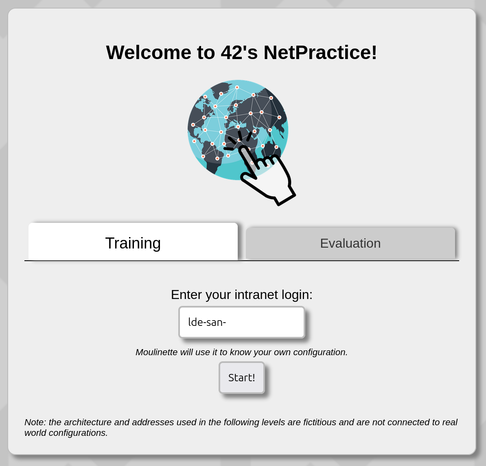
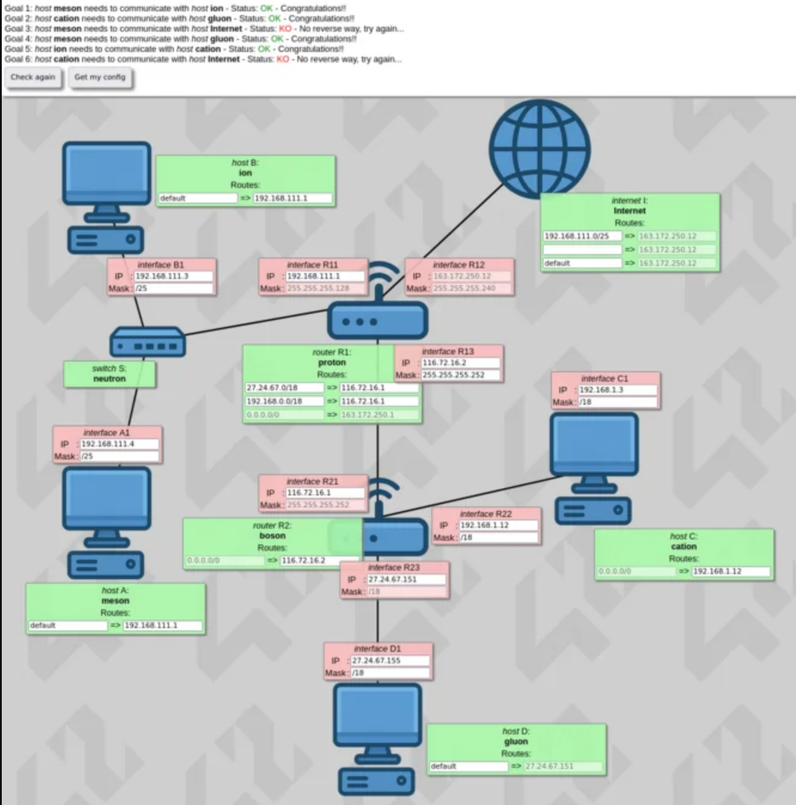
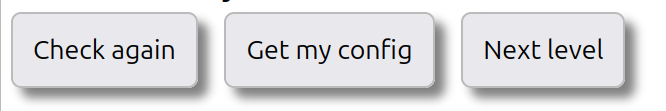
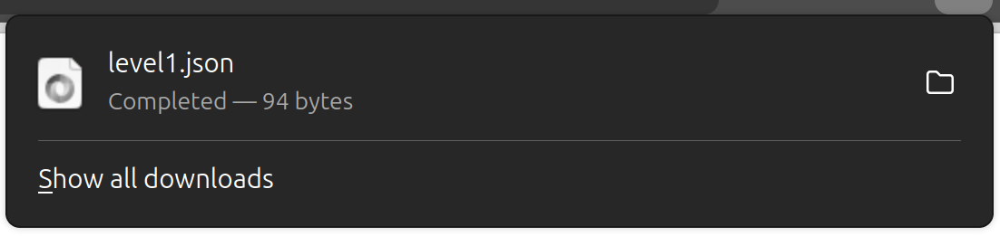
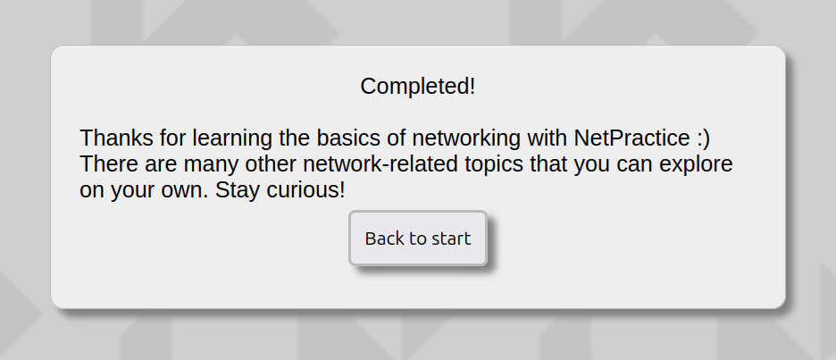

<p align="center"><i>This project has been created as part of the 42 curriculum by lde-san-</i></p>

<h1 align="center">🦝🌐 NetPractice 🌐🦝</h1>
<p align="center"><b><em>Routing Error? More Like User Error.</em></b></p>

---

## 🎯 Description

**NetPractice** is a practical project that provides the basis for IPv4 network administration, subnetting, and TCP/IP configuration. The primary objective of this project is to understand the fundamentals of network architecture, IP routing, and how machines physically communicate across small local networks and the broader internet. 

By configuring virtual interfaces, switches, and routing tables, the project helps create a deeper understanding of subnet boundaries, the mathematical limits of IP addresses, and the strict rules that govern traffic flow (and why routers panic when those rules are broken).

### 🧠 *Core Architecture & Concepts:*
- IPv4 Addressing & CIDR Notation:
> Understanding 32-bit addresses and utilizing Classless Inter-Domain Routing notation (e.g., `/26`, `/30`) to define network "locks" and host boundaries.
- Subnet Boundary Calculation:
> Learning to mathematically slice the 0-255 address space into perfectly adjacent, non-overlapping segments, that make it possible for routers to divert information without needing to analyze the entirety of the IP address.
- Routing Table Configuration:
> Establishing two-way communication streets, default gateways, and utilizing the `0.0.0.0/0` address to route traffic out to the Internet.
- Overlap Diagnostics (Avoiding MIMEs):
> Diagnosing and fixing *Multiple Interface Match Errors* by ensuring a router's delivery zones (network blocks) never intersect.
- Protocol Fundamentals:
> Differentiating between the TCP 3-Way Handshake (reliable, tracked data) vs. UDP (fast, untracked data).
- Special IPs:
> Understanding special reserved blocks like Loopback (`127.X.X.X`) and Private IPs (RFC 1122 & 1918).

---

## 🤖 AI Usage

AI was used as a **supporting tool**, mainly for:

 - 📘 General documentation lookup *(e.g., standardizing RFC protocols, Dissecting Acronyms, understanding the physical limitations of binary subnet masks)*
 - 🔍 Conceptual reviewing / translating technical language into analogies.
 - 💣 Preventing sanity loss when trying to figure out why my `127.X.X.X` or `10.X.X.X` IPs are not working as a "normal".

## 🛠️ Instructions & Tools

To complete the project, it is necessary to extract a number of files from the school's provided material. We download said file, extract its content and execute the training interface from the shell script **run.sh**.

```bash
wget https://school.domain.42.fr/path_to_file/net_practice.tgz

Connecting to school.domain.42.fr.. connected.
HTTP request sent, awaiting response... 200 OK
Length: 424242 (size) [application/octet-stream]
Saving to: ‘net_practice.tgz’

net_practice.tgz    100%[=============================>]   size  4.2MB/s    in 0.42s    

today now (4.2 MB/s) - ‘net_practice.tgz’ saved
```
```bash
tar -xvzf net_practice.tgz
```
```bash
./run.sh
```

When you run the `run.sh` executable, a window of your default browser opens up, prompting the user to enter their 42 School intra login to start the practice:

<p align="center">
 
</p>

On this Training Tab, clicking the `Start!` button will take you to a series of exercises with increasing difficulty. Like the one we can see below. With the goals in the top telling us the communication routes that we need to set up, and with a **log** section on the right that helps visualize when an error occurs.

<p align="center">
 
</p>

Also on the top, we have a `Check Again` button, to check our current configuration. A `Get My Config` button, that will download a **.json** file containing our current answer to the exercise. And finally, if all the objectives of the exercise are completed successfully, a `Next level` button will appear so we can move on to the next exercise.

<p align="center">
 <br>
 
</p>

### 📝 Submission details
> The files downloaded by the `Get My Config` button, will later be submitted to the School's evaluation machine **Moulinette** to be graded. So all 10 exported configuration files (one per level) must be placed at the repository root.

### 🧮 The Unsung Hero. The In-Terminal Basic Calculator `bc` 

Working through this project would have taken weeks if it wasn't for this tool and the way it helps turn decimal values into binary and vice-versa in order to understand what the machine truly sees behind the scenes.

• **Convert Decimal to Binary** (To visualize subnet locks):

```
bc
obase=2
192
# Output: 11000000
```

• **Convert Binary to Decimal** (To calculate maximum ranges):

```
bc
ibase=2
11111111
# Output: 255
```
---

## 🤖 Resources

This project required research on the following topics:
- TCP/IP addressing.
- Subnet Masks.
- Default Gateways.
- Routers and Routing Tables.
- Switches.
- OSI layers.

Further details, conclusions, sources and research notes may be found below and on the [Project's Documentation](https://github.com/Raccoonatic/NetPractice/blob/main/Documentation/NetPractice_lde-san-.pdf) in the repository.

- Understanding the Concepts:<br>

> - [TCP/IP & OSI models](https://www.youtube.com/watch?v=3b_TAYtzuho)
> - [OSI Model](https://www.youtube.com/watch?v=vv4y_uOneC0)
> - [Binary Conversion](https://www.rapidtables.com/convert/number/binary-to-decimal.html)

- Focus Boost:<br>
> - [Background Noise](https://www.youtube.com/watch?v=kN-iEJ3Sbsc&list=PLcL9r1K3TSwpOVyQKP1MruSuY-NS99iQY)
> - [Foreground Noise](https://open.spotify.com/playlist/5O5q1xG6hNt7NDA8tmT2KJ?si=c9f448d17bba40dc)<br>

---

## 🧾 Final Notes 🦝💜

If you made it this far…

Merry Christmas. Take a break. Drink water. Maybe eat an arepa.

Don’t let [Glutto](https://github.com/Raccoonatic/Glutto-The-Fox) eat them all.

💥🧡✨

<p align="center">
  <a href="https://github.com/Raccoonatic/NetPractice">
    
  </a>
</p>
